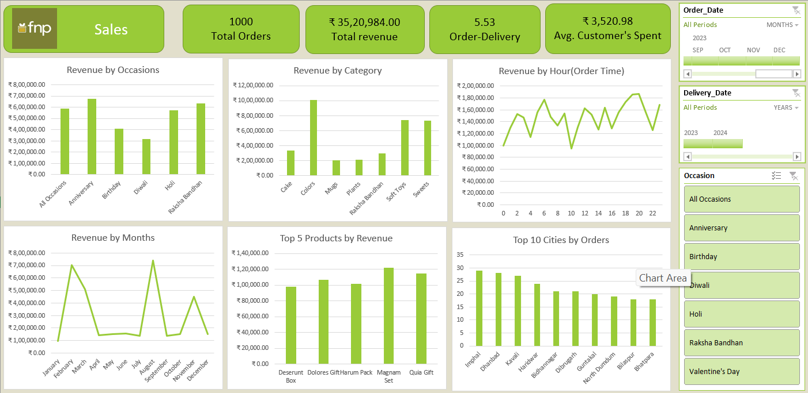

# FNP Sales Analysis 
This project analyzes sales data from Ferns N Petals (FNP) to uncover trends, customer behavior, and occasion-based revenue patterns. It helps identify the best-performing months, products, and occasions, providing actionable business insights.

---

## Dashboard Preview

## Dataset Information
- ['orders.csv'](./dataset/orders.csv): Contains order-level data including Order Date, Occasion, City, Category, Product Name, and Revenue.
- ['products.csv'](./dataset/products.csv): Includes product-level details such as Product ID, Name, Category, and Price.
- ['customers.csv'](./dataset/customers.csv): Contains customer-related information such as Customer ID, Gender, and City.
- 

## Dashboard Highlights

The dashboard includes:

- **KPI Cards**:
   - Total Orders
   - Total Revenue
   - Average Order-Delivery Time Gap
   - Average Customer Spend

- **Key Visualizations**:
  - Revenue by **Occasions**, **Categories**, and **Months**
  - Top 5 Products by Revenue
  - Orders by Hour (Order Time)
  - Top 10 Cities by Order Volume

> All visualizations are built using Excel Pivot Tables, Charts, and Slicers for interactive filtering.

---

## Tools Used

- **Microsoft Excel**
  - Pivot Tables
  - Pivot Charts
  - Slicers
  - Cell formatting for KPIs

## How to Use

1. Download or clone this repository.
2. Open the Excel file: fnp_sales.xlsx(fnp_sales.xlsx).
3. Use the filters (slicers) on the right-hand side to explore data by:
   - Date Range
   - Delivery Year
   - Occasion

